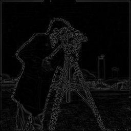

# Canny Edge Detection on RISC-V (RVV)

This repository contains a bare-metal C++ implementation of the Canny Edge Detection pipeline, specifically optimized for the RISC-V architecture using the Vector Extension (RVV 1.0). The project was developed and profiled using QEMU user-mode emulation running on WSl machine. 

Our focus was on the "optimization journey"—starting with a clean, scalar C++ baseline and systematically utilizing compiler flags, profiling tools, and hand-written vector intrinsics to maximize hardware utilization.

## Visual Results

Below is the result of our pipeline applying the 5x5 Gaussian Blur, Sobel Gradient (Magnitude & Direction), and L1 Norm conversions.

| Input Image (`test.png`) | Edge Detection Output (`edges.png`) 256px x 256px|
| :---: | :---: |
|  |  |


## The Optimization Journey

We profiled our initial scalar pipeline to identify bottlenecks. The 5x5 Gaussian Convolution and Sobel Gradient stages accounted for over 90% of the total CPU cycles. We targeted these "hot kernels" for vectorization using RISC-V strip-mining techniques, fixed-point arithmetic, and complex LMUL widening chains.

### Performance Data (Wall-clock time in ms)

| Stage | -O0 | -O2 | -O3 | Auto-vec | RVV 128 | RVV 256 |
| :--- | :--- | :--- | :--- | :--- | :--- | :--- |
| **Gaussian 5x5** | 19.16 ms | 157.06 ms* | 18.46 ms | 20.57 ms | 10.44 ms | 8.38 ms |
| **Sobel Gx/Gy** | 2.30 ms | 0.40 ms | 4.03 ms | 4.24 ms | 1.27 ms | 1.15 ms |
| **Magnitude** | 0.99 ms | 4.41 ms | 4.44 ms | 4.44 ms | 0.65 ms | 0.75 ms |
| **Direction** | 1.04 ms | 1.20 ms | 0.51 ms | 0.50 ms | scalar | scalar |
| **Binary size** | 1.2 MB | 1.2 MB | 1.2 MB | 1.2 MB | 1.2 MB | 1.2 MB |

### Key Takeaways & Analysis
* **The RVV Speedup:** Writing bare-metal RISC-V vector intrinsics was a massive success. For our heaviest kernel (Gaussian), the `RVV 256` implementation took **8.38 ms**, more than doubling the performance of the best scalar `-O3` time (**18.46 ms**).
* **Proof of Vector-Length Agnosticism:** The time difference between `RVV 128` (10.44 ms) and `RVV 256` (8.38 ms) proves our logic is vector-length agnostic. Using `vsetvl`, the exact same compiled binary dynamically adapted to wider 256-bit registers on the QEMU CPU to process more pixels per loop.
* **The Limits of Auto-Vectorization:** The `-ftree-vectorize` (Auto-vec) column performed worse than standard `-O3` optimization. The GCC compiler failed to effectively vectorize our 2D convolution loops, proving that hand-writing intrinsics was necessary to unlock the hardware's speed.
* **The Emulation Anomaly:** The `-O2` Gaussian time spiked to 157 ms. Because QEMU translates instructions and relies on the host Linux kernel for thread scheduling, host-side background tasks occasionally interrupt the emulator, causing latency spikes.
* **Binary Size Consistency:** The binary size remained at 1.2 MB across all builds due to static linking (`-static`), which bundles the entire bare-metal Newlib C standard library into the executable.

---

## How to Build and Run

### Prerequisites
* **Linux Environment:** Native Linux or WSL2 (Ubuntu 24.04).
* **RISC-V Toolchain:** `riscv64-unknown-elf-g++` built from source with `--with-arch=rv64gcv`.
* **Emulator:** QEMU user-mode (`qemu-riscv64`).
* **Python 3:** With `Pillow` and `numpy` installed (for image conversions).

### 1. Prepare the Input Image
To convert your standard image into the raw binary format required by the bare-metal C++ code:
```bash
source .venv/bin/activate
pip install Pillow numpy
python3 convert_image.py
```
### 2. Run the Host-Side Unit Tests
To verify the core math and logic natively on your host machine:

```bash
make test
```
### 3. Run the QEMU Vector Equivalence Tests
To run the strict assert tests across different vector register widths (ensuring vector-length agnosticism):

```bash
make test_qemu
```
### 4. Execute the Profiling Sweep
To compile all scalar flags alongside the RVV binary, and run the complete timing sweep shown in our optimization table:

```bash
make run_timing_sweep
```
### 5. Output the detected edges of the image
To output the detected edges of the image using one command:

```bash
make edges